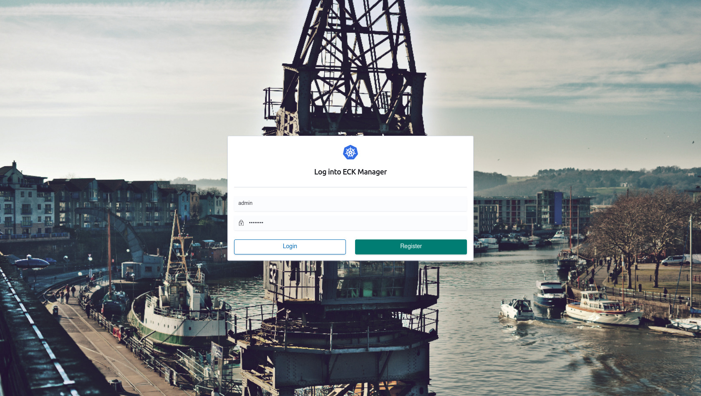
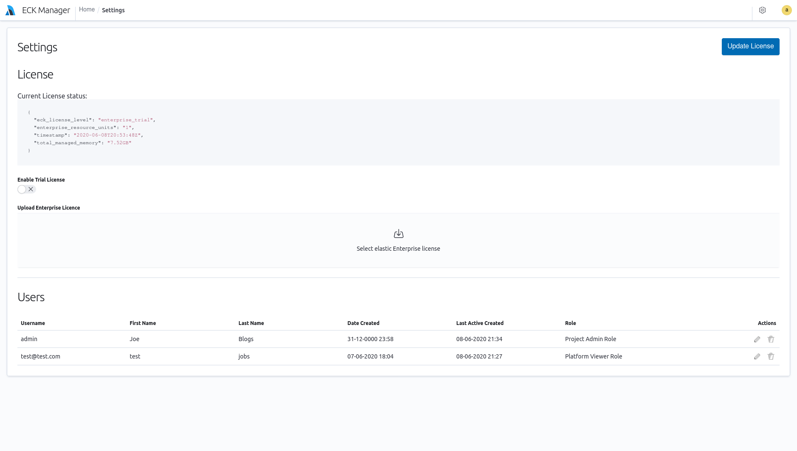
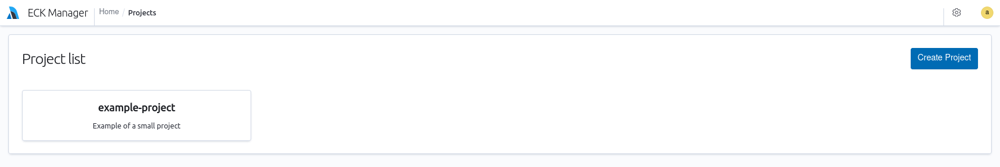
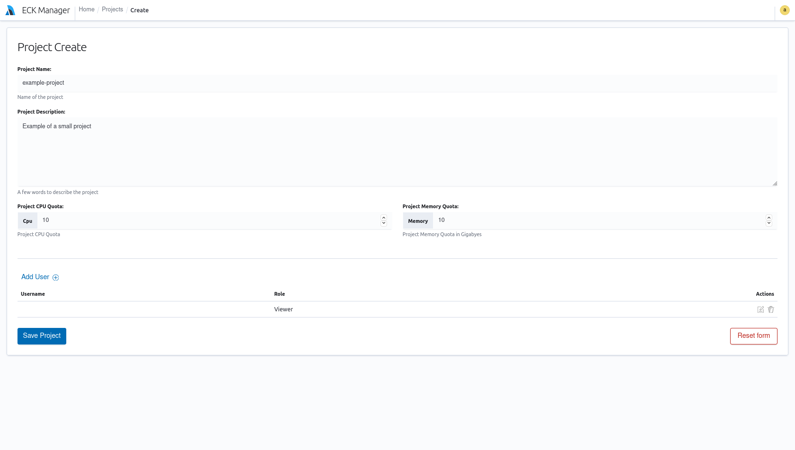
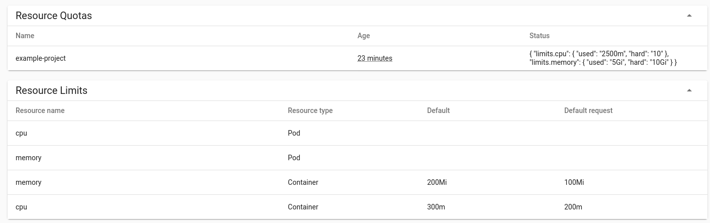
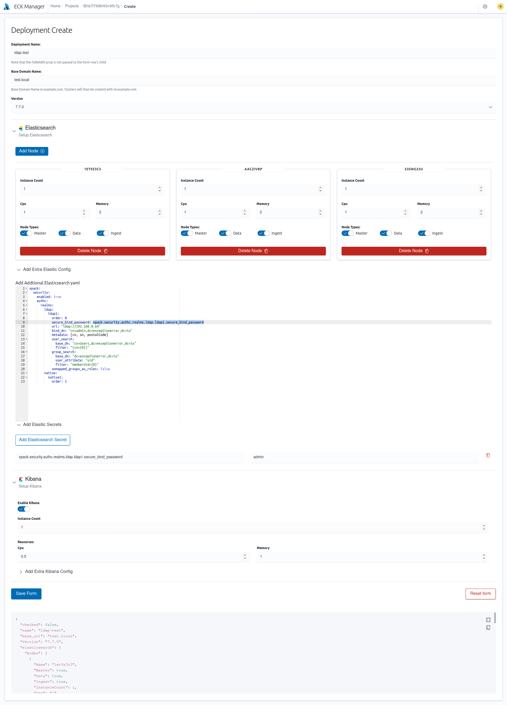
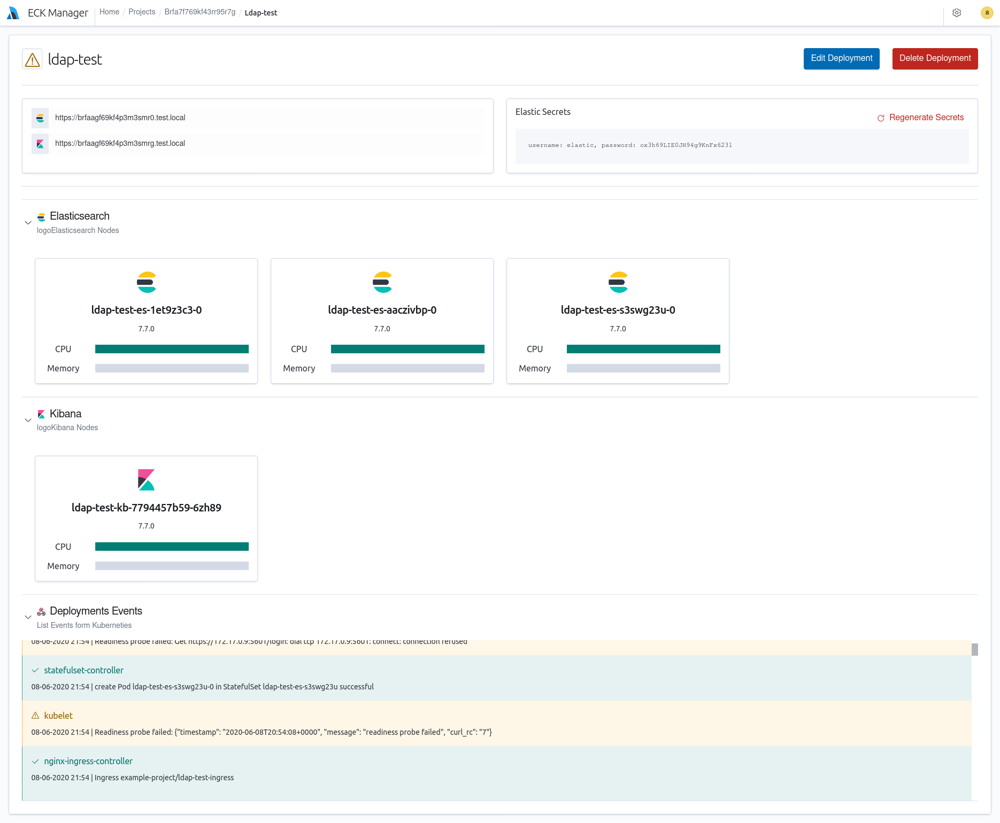
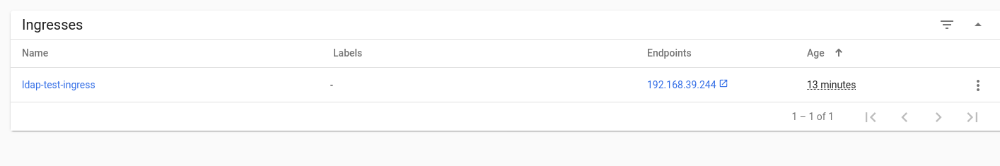

# ECK Manager
ECK Web UI for Elastic Cloud on Kubernetes
 
This project provides a small web manager for Cloud on k8.  It requires that the ECK operator to be deployed into a K8 cluster
See more details here https://www.elastic.co/guide/en/cloud-on-k8s/current/index.html
 
It also requires an Elastic enterprise licence to use after the 30 trial period.
 
**Note:** First this project is a proof of concept and should not be run in production. Secondly this has only been tested on a single minikube deployment.
 
 
 
## Build
Requires:
* Go: 1.13+
* Yarn: 1.22.0 +
* NPM: 6.13 +
* Make
 
This Project uses Make as a helpful wrapper around the different build systems for the frontend and backend
 
```
# Build everything
make build
 
# Build UI
make build-ui
 
# Build Backend
 
make build-server
```
 
## Running
When complied the application runs as a single binary `./eckManager -c config.yml`
 
The application on startup will create a new admin account with a username: `admin` and a random password you will find in the server log.
 
The application generates 2 log files a server.log and an audit.log that contains only the user actions.
 
Currently the application uses a sqlite esq datastore and will store all user and project data in this file called eckmanager.db. Deleting this file will cause the program to reset.
 
 
 
 
 
 
---
## Screenshots
 
### Login View:

 
### Settings View:
From the settings page you can edit the user roles and reset user passwords. You can also deploy a new Elastic Enterprise Licence into the Cluster or activate the 30 trial licence

 
### Projects
Project listing

 
Every Elasticsearch Deployment must live in its own Project. A project is a 1:1 mapping to a kubernetes namespace. From this view you can also set the resource limits for that namespace/project
 

 
Namespace resource limits from K8 dashboard.

 
 
### Deployments
The Deployment Creating View gives an easy to use way to configure all the main basic parameters that is needed to create an elasticsearch cluster and kibana.
 
This view also supports adding in custom elasticsearch.yml. In this example we are configuring an ldap realm. This view will also alloy you to create any secrets that you need stored in elasticsearch keystore, in this example the LDAP password is stored.

 
Once the Deployment is created you can see the result. This tool will show you the state of each node in the cluster as well as the elastic superuser details and allow you to reset the password.
 
This view will also capture the events K8 generates as part of the deployment so you can see what has gone wrong in the deployment.

 
 
The tool Will setup nginx ingress for both elasticsearch and kibana for all your deployments.
 

 
 
---
 
## Future Plans
There are a number of features that would be nice to have in this project these include but not limited to:
 
* Templated Deployments
* Certificate Management
* FileStorage for custom plugins and scripts that you want deployed
* Multi K8 Cluster support.
* Better Auth options (LDAP, SAML, Oauth etc)
* Some Unit and integration tests.
